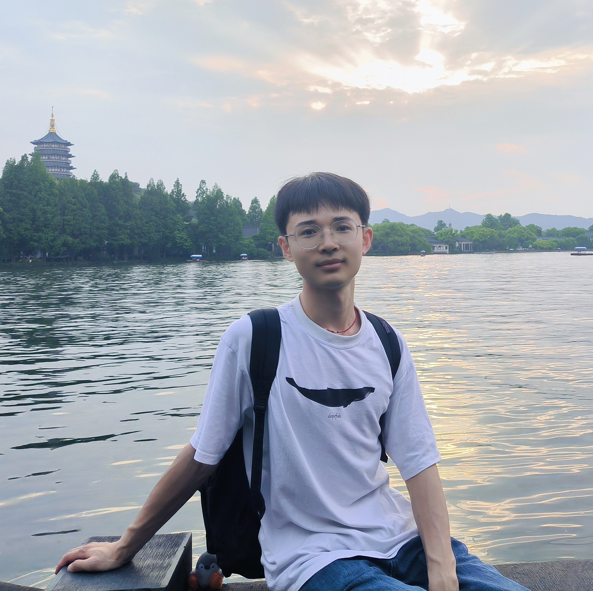
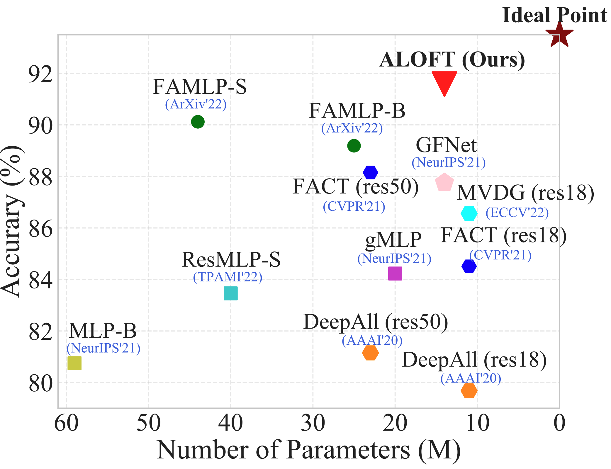

---
layout: page
---

<!-- <b>郭金涛</b>    -->
<b>Jintao Guo</b> <b>(郭金涛)</b>\
\
PhD. Student, [Reasoning & Learning Group](https://cs.nju.edu.cn/rl/index.htm) \
[Department of Computer Science and Technology](https://cs.nju.edu.cn/main.htm) \
[National Key Laboratory for Novel Software Technology](http://keysoftlab.nju.edu.cn/) \
[Nanjing University](https://www.nju.edu.cn/), Nanjing 210023, China \
**Supervisor:** Associate Professor [Yinghuan Shi](https://cs.nju.edu.cn/shiyh/index.htm) 

<!-- [Email](guojintao@smail.nju.edu.cn) | [Google Scholar](https://scholar.google.com/citations?user=K4lrdKc_YLUC) | [Github](https://github.com/lingeringlight) -->

 

## <b>Biography</b>
<!-- ## Biography -->
- - -
I am currently a first-year PhD student in [Department of Computer Science and Technology](https://cs.nju.edu.cn/main.htm) at [Nanjing University](https://www.nju.edu.cn/) and a member of [Reasoning & Learning Group](https://cs.nju.edu.cn/rl/index.htm), fortunately supervised by [Prof. Yinghuan Shi](https://cs.nju.edu.cn/shiyh/index.htm). \
I received my B.Eng. degree from [University of Science and Technology of China](https://www.ustc.edu.cn/) in June 2020. In September 2020, I was admitted to study for a M.Eng. degree in Nanjing University.

 

<!--
## <b>Research Interests</b>
My current research focuses on Computer Vision and Domain Generalization.
 
-->

## <b>News</b>

+ **[2024-02]** One paper about **Survey for DG in Complex Business Scenarios** is accepted by 《中国科学基金》.

+ **[2024-02]** One paper about **DG Classification** is accepted by IEEE TIP.

+ **[2023-09]** One paper about **DG Classification** is accepted by ACM TOMM.

+ **[2023-07]** One paper about **DG Classification** is accepted by ICCV 2023.

+ **[2023-02]** One paper about **DG Classification** is accepted by CVPR 2023.

 

## <b>Publications</b>
<!-- ## Publications -->
- - -
<!--  -->

+ **[基于可泛化模型的复杂商务场景数据分析](https://lingeringlight.github.io/)** \
史颖欢, **郭金涛**, 李泽昆, 祁磊, 高阳. \
_《中国科学基金》_ \
[Paper](https://lingeringlight.github.io/)

+ **[Learning Generalizable Models via Disentangling Spurious and Enhancing Potential Correlations.](https://arxiv.org/abs/2401.05752)** \
Na Wang, Lei Qi, **Jintao Guo**, Yinghuan Shi, Yang Gao. \
_IEEE Transactions on Image Processing (**IEEE TIP**)_ \
[Paper](https://arxiv.org/abs/2401.05752) | [Code](https://github.com/RubyHoho/DGeneralization/)

+ **[PLACE dropout: A Progressive Layer-wise and Channel-wise Dropout for Domain Generalization](https://arxiv.org/abs/2112.03676)** \
**Jintao Guo**, Lei Qi, Yinghuan Shi, Yang Gao. \
_ACM Transactions on Multimedia Computing Communications and Applications (**ACM TOMM**)_ \
[Paper](https://arxiv.org/abs/2112.03676) | [Code](https://github.com/lingeringlight/PLACEdropout/)

+ **[DomainDrop: Suppressing Domain-Sensitive Channels for Domain Generalization](https://lingeringlight.github.io/)** \
**Jintao Guo**, Lei Qi, Yinghuan Shi. \
_IEEE International Conference on Computer Vision (**ICCV**)_, 2023 \
[Paper](https://arxiv.org/abs/2308.10285) | [Code](https://github.com/lingeringlight/DomainDrop/)｜[Zhihu](https://zhuanlan.zhihu.com/p/652198004)

+ **[ALOFT: A Lightweight MLP-like Architecture with Dynamic Low-frequency Transform for Domain Generalization](https://arxiv.org/abs/2303.11674)** \
**Jintao Guo**, Na Wang, Lei Qi, Yinghuan Shi. \
_IEEE Conference on Computer Vision and Pattern Recognition (**CVPR**)_, 2023 \
[Paper](https://arxiv.org/abs/2303.11674) | [Code](https://github.com/lingeringlight/ALOFT/) | [Zhihu](https://zhuanlan.zhihu.com/p/624598279)

 

## <b>Services</b>
<!-- ## Services -->
- - -
+ Reviewer for TCSVT, JBHI, AAAI 2021, ICCV 2021, AAAI 2022, IJCAI2023.

 

## <b>Correspondence</b>
<!-- ## Correspondence -->
- - -

**Email**: guojintao@smail.nju.edu.cn \
**Address**: Guo Jintao, National Key Laboratory for Novel Software Technology, Nanjing University, 163 Xianlin Avenue, Qixia District, Nanjing 210023, China. 
